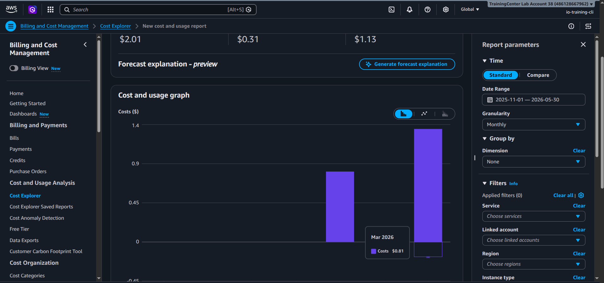
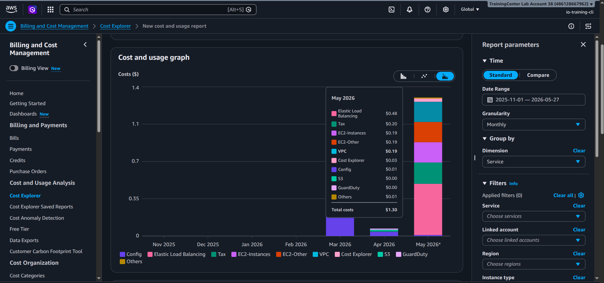
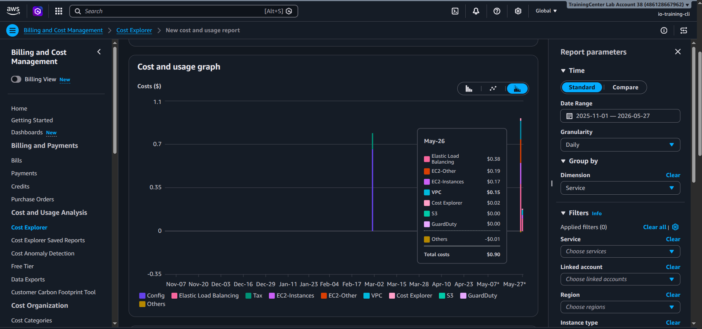
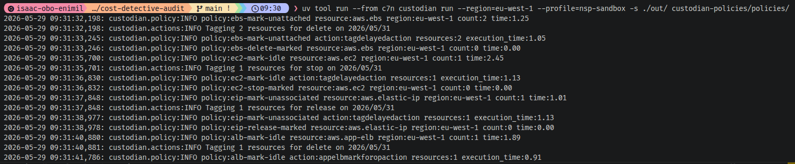
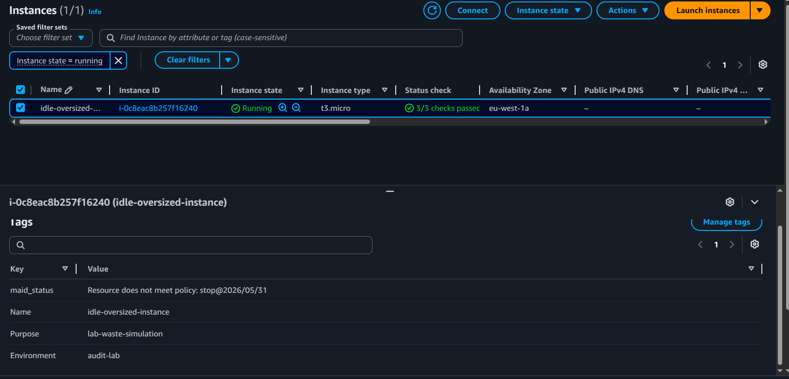

# Cost Detective Audit

## **The Scenario**
Inheriting an AWS account from a previous team that was reckless with spending, resulting in a tight budget. The objective of this project is to identify waste, implement rigorous governance, and propose a highly cost-aware architecture.

This repository serves as a comprehensive DevOps and FinOps blueprint to model, identify, and remediate cloud cost waste within Amazon Web Services (AWS) using **Terraform** and **Cloud Custodian**.

---

## **Objectives & Implementation**

### **1. Analysis and Cleanup**

#### **Detecting "Zombie Assets"**
The repository uses Terraform (`terraform/01-wasteful-resources/`) to intentionally provision underutilized and orphaned AWS resources in a sandbox:
* **Idle EC2 Instances**
* **Unattached EBS Volumes**
* **Unassociated Elastic IPs (EIP)**
* **Idle Application Load Balancers (ALB)**

AWS Cost Explorer was utilized to detect these cost spikes and wasteful resources:


*Fig: Selecting the appropriate date range to investigate costs.*


*Fig: Breaking down cost contributions by AWS services.*


*Fig: Identifying the exact day the cost spike occurred.*

#### **Automated Garbage Collection**
Instead of a simple manual script, this project implements a highly scalable, declarative garbage collector using **Cloud Custodian**. The policies (`custodian-policies/policies/`) mark orphaned resources (like unattached EBS volumes) and automatically orchestrate its termination/deletion after a 2-day grace period.


*Fig: Running Cloud Custodian to check policies.*


*Fig: Verifying resources tagged for deletion natively in the AWS Console.*

---

### **2. Governance**

* **Active Cost Controls (Budgets):** Deployed via Terraform (`terraform/02-governance/`), an AWS Cost Budget is configured to send alerts (via SNS/Email) when the forecasted spend exceeds a critical limit.
* **Tagging Policy (SCP):** Inside `terraform/modules/governance/scp/`, there is an implementation of an AWS Service Control Policy (SCP) that strictly prohibits the launching of any EC2 instance unless it has a valid `CostCenter` tag. *(Note: SCPs require AWS Organizations Management account access to apply).*

---

### **3. Optimization Architecture**

To prove structural cost reduction, this project provides a modularized **Auto Scaling Group with a Mixed Instances Policy** (`terraform/03-optimization/` & `terraform/modules/optimization/asg-spot/`). 

This architecture successfully combines a safe On-Demand baseline with AWS Spot Instances (which are up to 90% cheaper) for scalable, stateless workloads. It automatically responds to capacity rebalances and handles instance interruptions safely.

**📚 Detailed Guide:** View the complete [End-to-End AWS Cost Optimization Guide](docs/end-to-end-optimization-guide.md) created for this audit.

---

## **Technical Prerequisites**
To interact with and deploy this project locally, ensure you have:
* **Terraform** (v1.7.0 or greater)
* **AWS CLI** (Configured with appropriate access credentials)
* **Python 3.x**
* **uv** (Extremely fast Python package installer and resolver)

## **Project Structure**
```text
.
├── custodian-policies/          # Modular Cloud Custodian rules
│   ├── data/                    # JSON metadata (e.g., tag allowlisting)
│   └── policies/                # YAML policies segregated by AWS service
├── docs/                        # Remediation guides and audit reports
├── screenshots/                 # Visual proof of Cost Explorer and Custodian actions
└── terraform/                   # Infrastructure as Code deployments
    ├── 01-wasteful-resources/   # Deliberate waste provisioner
    ├── 02-governance/           # Budget and SCP deployment
    ├── 03-optimization/         # Spot instance ASG architecture
    └── modules/                 # Reusable networking, compute, and governance modules
```

## **Installation & Usage**

### 1. Infrastructure Deployment (Simulate Waste)
To simulate the wasteful environment, initialize and apply the Terraform configuration:
```bash
cd terraform/01-wasteful-resources
terraform init
terraform apply
```

### 2. Cloud Custodian Tooling
Install Cloud Custodian globally in an isolated environment using `uv`:
```bash
uv tool install c7n
```

### 3. Auditing and Remediation
Validate the policies and seamlessly dry-run against the infrastructure:
```bash
uv tool run --from c7n custodian validate custodian-policies/policies/**/*.yml
uv tool run --from c7n custodian run --dryrun --region <YOUR_REGION> --profile <YOUR_PROFILE> -s ./out custodian-policies/policies/
```
Removing the `--dryrun` flag applies the remediation logic (e.g., tagging instances for cleanup).

### 4. Teardown
To avoid unnecessary cloud charges, fully destroy the simulated environment using Terraform:
```bash
cd terraform/01-wasteful-resources
terraform destroy
```
